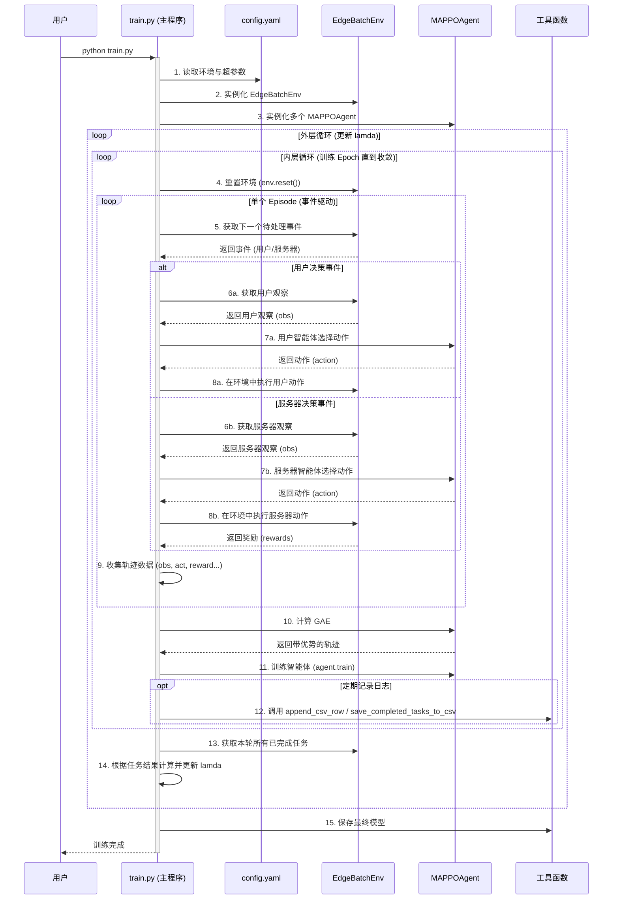

# 技术架构文档 (Architect.md)

## 1. 项目概述 (Project Overview)

本项目是一个基于多智能体强化学习（MARL）的系统，专为模拟和优化边缘计算场景而设计。其核心目标是解决一个复杂的权衡问题：在最大化用户效用（通过奖励函数体现）的同时，最小化整个系统的信息年龄（Age of Information, AoI）。AoI 是一个衡量数据新鲜度的关键性能指标，在需要高时效性数据的场景中至关重要。

为实现这一目标，项目采用了 **多智能体近端策略优化 (Multi-Agent Proximal Policy Optimization, MAPPO)** 算法，这是一种在多智能体协作与竞争环境中表现出色的先进强化学习算法。整个项目的神经网络模型基于 **PyTorch** 框架构建。

## 2. 核心设计理念 (Core Design Philosophy)

项目严格遵循了现代软件工程的最佳实践，其核心设计理念可以概括为以下几点：

*   **配置驱动 (Configuration-Driven)**: 项目的核心驱动力来自于 [`config.yaml`](./config.yaml:1) 文件。所有与实验相关的参数，包括环境设置（如用户数、服务器数）、模型超参数（如学习率、折扣因子）等，都集中在此文件中进行管理。这种设计将易变的配置与稳定的代码逻辑彻底分离，极大地提升了实验的灵活性和可复现性，研究人员可以快速调整参数进行多次实验，而无需触及任何代码。

*   **模块化与关注点分离 (Modularity & Separation of Concerns)**: 项目的代码结构清晰，通过将不同的功能逻辑划分到独立的模块中，实现了高度的模块化和低耦合。每个文件职责明确、功能单一：
    *   [`config.yaml`](./config.yaml:1): 负责所有配置参数。
    *   [`env.py`](./env.py:1): 负责模拟边缘计算环境的动态变化。
    *   [`model.py`](./model.py:1): 负责定义智能体（Agent）的神经网络结构和核心强化学习算法。
    *   [`train.py`](./train.py:1): 负责编排和驱动整个训练流程。
    *   [`utils.py`](./utils.py:1): 负责提供可被多处复用的通用工具函数。

    这种设计使得代码更易于理解、维护和扩展。

## 3. 模块详解 (Module Breakdown)

#### `config.yaml`
*   **职责**: 项目的“控制面板”，是所有可调参数的唯一来源。
*   **内容**: 文件结构化地分为两个主要部分：
    *   `hyperparameters`: 包含了所有与 MAPPO 算法相关的超参数，例如 `learning_rate`, `gamma`, `batch_size` 等。
    *   `env`: 定义了模拟环境的物理属性和约束，例如 `Num_users`, `Num_servers`, `Max_queue_len` 等。

#### `env.py`
*   **职责**: 定义 `EdgeBatchEnv` 类，精确模拟一个事件驱动的边缘计算环境。
*   **核心功能**:
    *   **状态管理**: 维护全局时间 `self.t`、所有用户（User）和服务器（Server）的内部状态。
    *   **事件驱动**: 通过 `get_next_event()` 方法找出时间线上最早发生的事件，驱动整个模拟向前进行。
    *   **接口定义**: 为智能体提供标准的交互接口，包括观察空间 (`get_user_obs`, `get_server_obs`) 和动作空间 (`user_action_space`, `server_action_space`)。
    *   **物理引擎**: 实现 `step_*` 系列方法，用于执行智能体选择的动作，并根据环境内置的规则（如处理时间、任务入队等）更新环境状态。
    *   **奖励计算**: 在关键事件（如 `step_server_end`）发生后，计算并返回相应的奖励。

#### `utils.py`
*   **职责**: 一个通用的工具函数库，封装了项目中可复用的辅助功能。
*   **核心功能**:
    *   **模型 I/O**: `save_model` 和 `load_model` 函数，用于模型的持久化存储和加载。
    *   **日志与数据处理**: `append_csv_row` 和 `save_completed_tasks_to_csv`，方便地将训练过程中的关键数据记录到 CSV 文件中。
    *   **指标计算**: `evaluate_aoi` 用于计算核心性能指标——平均信息年龄；`normalize_rewards` 和 `scale_rewards` 用于对奖励进行预处理。
    *   **结果可视化**: 提供了一系列 `plot_*` 函数，如 `plot_train_test_curves` 和 `plot_aoi_and_user_reward_vs_epoch_smooth`，能够将 CSV 日志文件中的数据转换成直观的图表，便于分析训练效果。

#### `model.py`
*   **职责**: 定义强化学习智能体的核心组件，包括神经网络结构和 MAPPO 算法的实现。
*   **核心组件**:
    *   **网络结构**: `Actor` 和 `Critic` 类是构成 Actor-Critic 架构的基础神经网络。`GaussianActor` 是 `Actor` 的一个变种，专门用于处理连续动作空间（通过输出高斯分布的均值和标准差）。
    *   **智能体封装**: `MAPPOAgent` 类是核心的智能体封装，它整合了 Actor 和 Critic 网络，并提供了与环境交互和进行学习所需的所有接口，如动作选择 (`select`) 和模型参数更新 (`train`)。
    *   **优势计算 (GAE)**: `compute_gae` 函数实现了**泛化优势估计 (Generalized Advantage Estimation)**。GAE 是一种在策略梯度方法中用于降低梯度估计方差的先进技术，能够有效地平衡偏差和方差，从而稳定和加速学习过程。

#### `train.py`
*   **职责**: 项目的启动入口和训练流程的总指挥。
*   **核心流程**:
    *   **初始化**: 脚本启动后，首先从 [`config.yaml`](./config.yaml:1) 加载配置，然后根据配置实例化 `EdgeBatchEnv` 环境和多个 `MAPPOAgent` 智能体（包括用户和服务器的智能体）。
    *   **双层循环训练**: 这是本项目的核心训练范式。
        *   **外层循环**: 负责迭代更新 `lamda` 参数。`lamda` 是一个关键的超参数，用于在奖励函数中权衡用户效用和 AoI 的惩罚项。通过在每次内层循环收敛后重新计算并更新 `lamda`，系统能够自动寻找最优的平衡点。
        *   **内层循环**: 在一个固定的 `lamda` 值下，进行多个 epoch 的标准强化学习训练，直到智能体的策略收敛。
    *   **数据收集与训练**: 在每个 epoch 中，智能体与环境进行交互，收集完整的轨迹数据（(state, action, reward, ...)，然后调用 `compute_gae` 计算优势函数，最后将这些数据送入 `agent.train()` 方法中，使用 PPO 算法更新 Actor 和 Critic 网络的参数。
    *   **日志与保存**: 在训练过程中，会定期调用 [`utils.py`](./utils.py:1) 中的函数，将训练奖励、AoI 等关键指标记录到 CSV 文件，并保存模型的检查点。

## 4. 数据与执行流程 (Data and Execution Flow)

以下流程图详细描述了一次完整的模型训练过程，展示了各个模块之间是如何协同工作的。



## 5. 如何运行与扩展 (How to Run and Extend)

#### 运行项目
1.  **安装依赖**: (假设已安装 Python 和 pip)
    ```bash
    pip install torch numpy pyyaml pandas matplotlib
    ```
2.  **启动训练**:
    ```bash
    python train.py
    ```
3.  **查看结果**: 训练过程中的日志、图表和最终模型文件将被保存在 `./trainlog/` 目录下的一个带时间戳的子目录中。

#### 扩展指导
*   **调整超参数或环境设置**:
    *   **操作**: 直接修改 [`config.yaml`](./config.yaml:1) 文件中的值。
    *   **场景**: 这是最常见的操作，例如调整学习率、增加用户数量或改变队列长度。

*   **改进模型结构**:
    *   **操作**: 在 [`model.py`](./model.py:1) 中修改 `Actor` 或 `Critic` 类的网络层定义（例如，增加层数、改变激活函数）。
    *   **注意**: 如果要引入全新的模型架构，可以创建一个新的 Agent 类，并确保它遵循 `MAPPOAgent` 的接口，然后在 [`train.py`](./train.py:1) 中进行实例化替换。

*   **修改环境行为**:
    *   **操作**: 在 [`env.py`](./env.py:1) 中修改 `EdgeBatchEnv` 类的内部逻辑。
    *   **场景**: 例如，改变任务处理时间的计算方式、引入新的事件类型等。
    *   **注意**: 对环境的修改是牵一发而动全身的。任何对状态、观察空间、动作空间或奖励函数的修改，都可能需要同步更新 [`model.py`](./model.py:1) 中的网络输入输出维度和 [`train.py`](./train.py:1) 中的交互逻辑。

*   **增加新的工具函数或分析图表**:
    *   **操作**: 在 [`utils.py`](./utils.py:1) 中添加新的函数。
    *   **场景**: 例如，需要计算一个新的性能指标，或者绘制一种新的数据对比图。添加后，在 [`train.py`](./train.py:1) 或其他需要的地方直接调用即可。
